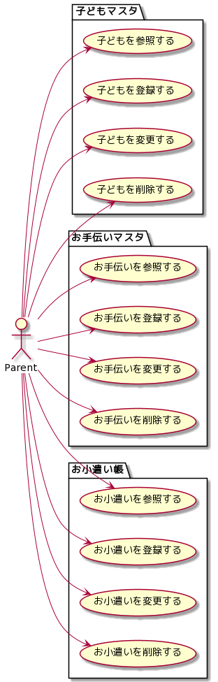

# 要件定義

## ユーザー定義

親ユーザー…お小遣いを得る子どもの親。

## 機能要件

- 子どもマスタ機能
    - 親ユーザーは子どもを登録できる
      - 項目：名前、生年月日
    - 親ユーザーは登録内容を参照・編集・削除できる
- お手伝いマスタ機能
  - 親ユーザーはお手伝いを登録できる
    - 項目：お手伝いの名前、金額
  - 親ユーザーは登録内容を参照・編集・削除できる
- お小遣い帳
    - 親ユーザーは子どもが実行したお手伝いを登録できる。
    - お手伝いの記録を元に現在のお小遣い総額を表示する。

## ユースケース

## シナリオ
- 親ユーザーは自分の子どもを登録する。
- 親ユーザーは自分の子どもへのお小遣い付与対象となるお手伝いを登録する。
- 親ユーザーは子どもがお手伝いしたのを確認し、本アプリでお小遣い帳にどの子どもがどのお手伝いをしたか記録する。
- 親ユーザーは子どもにお小遣いを渡したとき、本アプリでお小遣い帳からその金額を差し引く。